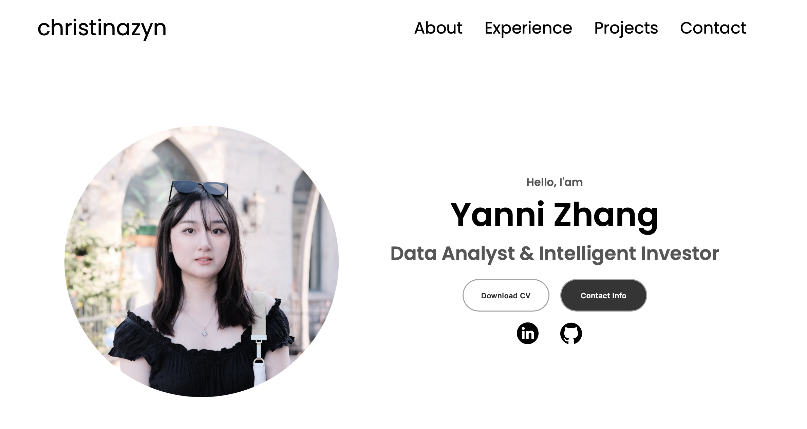

# Welcome

Hello, I am Yanni. Here is a listing of all my open source project experience.

# Projects

- [Excel](#excel)
  - [Coffee Sales Dashboard](#coffee-sales-dashboard)
  - [Road Accident Dashboard](#road-accident-dashboard)
- [SQL](#sql)
  - [Yelp User &amp; Review Analysis](#yelp-user--review-analysis)
- [Python](#python)
  - [New York City Airbnb Analysis](#new-york-city-airbnb-analysis)
- [Front-End](#front-end)
  - [My Portfolio Website](#my-portfolio-website)
  - [Cornell Guest Counter App](#cornell-guest-counter-app)

### Excel

#### [Coffee Sales Dashboard](https://github.com/christinazyn/excel-coffee-sales)

#### [Road Accident Dashboard](https://github.com/christinazyn/excel-road-accident)

### SQL

#### [Yelp User &amp; Review Analysis](https://github.com/christinazyn/sql-yelp-project)

### Python

#### [New York City Airbnb Analysis](https://github.com/christinazyn/airbnb-nyc-analysis)

### Front-End

#### [My Portfolio Website](https://github.com/christinazyn/website-portfolio)

#### [Cornell Guest Counter App](https://github.com/christinazyn/cornell-guest-counter)

